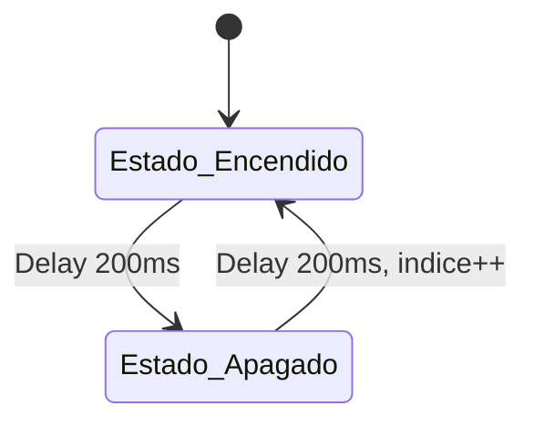

# App 1.1: Secuenciador de LEDs Onboard

## Título y Objetivos
**App 1.1: Secuenciador de LEDs Onboard**

El objetivo de esta aplicación es implementar una secuencia de encendido y apagado de los LEDs integrados (onboard) de la placa de desarrollo (STM32 Nucleo-F439ZI). Se busca aplicar conceptos de **Máquinas de Estados Finitos (MEF)** y **programación orientada a hardware**, garantizando un código generalista y escalable mediante el uso de estructuras de datos (vectores/arrays).

## Especificaciones del Circuito
* **Placa:** Nucleo-STM32F439ZI.
* **Hardware:**
    * LED1 (Green) - LD1.
    * LED2 (Blue) - LD2.
    * LED3 (Red) - LD3.
* **Temporización:** Alternancia de 200 ms en estado alto (ON) y 200 ms en estado bajo (OFF) por cada LED.

## Teoría de Operación
El sistema se basa en una **Máquina de Estados Finitos (MEF)** de dos estados: `Estado_Encendido` y `Estado_Apagado`. 
1. Al ingresar a `Estado_Encendido`, el sistema activa el pin correspondiente al índice actual del array de LEDs y espera 200 ms. 
2. Al transicionar a `Estado_Apagado`, se desactiva el pin, espera otros 200 ms, e incrementa el índice para apuntar al siguiente LED. 
3. Se implementa una lógica de reinicio de índice al alcanzar el último elemento del array, garantizando la naturaleza cíclica de la secuencia.

## Arquitectura del Software
El diseño se basa en tres capas para asegurar el desacoplamiento:

* **Capa 1 (Hardware Mapping):** Definición de una estructura `GPIO_Config_t` que contiene el puntero al puerto y el número de pin, permitiendo mapear cualquier cantidad de LEDs sin modificar la lógica principal.
* **Capa 2 (Drivers):** Uso de las funciones de la HAL (`HAL_GPIO_WritePin`) para interactuar con los registros del microcontrolador.
* **Capa 3 (Aplicación):** MEF implementada en el `while(1)` que gestiona la lógica de control.

### Diagrama de Estados (Mermaid)

### Detalle Capa 1
```c
typedef struct{
	GPIO_TypeDef* port;
	uint16_t pin;
} GPIO_Config_t;

const GPIO_Config_t leds_array [] = {
		{LD1_GPIO_Port, LD1_Pin},
		{LD2_GPIO_Port, LD2_Pin},
		{LD3_GPIO_Port, LD3_Pin}
};
```
### Detalle Capa 2

```c
HAL_GPIO_WritePin(leds_array[indice].port, leds_array[indice].pin, GPIO_PIN_SET);
```

### Detalle Capa 3

```c
switch (estado) {
    case Estado_Encendido:
        HAL_GPIO_WritePin(leds_array[indice].port, leds_array[indice].pin, GPIO_PIN_SET);
        HAL_Delay(tiempo);
        estado = Estado_Apagado;
        break;
    case Estado_Apagado:
        HAL_GPIO_WritePin(leds_array[indice].port, leds_array[indice].pin, GPIO_PIN_RESET);
        HAL_Delay(tiempo);
        estado = Estado_Encendido;
        indice++;
        if(indice >= cant_leds) indice = 0;
        break;
}
```

### Detalles de Robustez
Para evitar comportamientos erráticos, se implementó una sección `default` en la MEF. Si por un error de memoria o transitorio el estado llegara a un valor indefinido, el sistema realiza:
* **Un reset físico de todos los pines:** (apagado de emergencia).
* **Reinicio de las variables de control:** (`estado` y `indice`) a sus valores iniciales.

### Mapeo de Hardware
| LED | Puerto | Pin | Función |
| :--- | :--- | :--- | :--- |
| LD1 | GPIOB | LD1_Pin | LED Verde |
| LD2 | GPIOB | LD2_Pin | LED Azul |
| LD3 | GPIOB | LD3_Pin | LED Rojo |

### Conclusión
La implementación lograda permite una gestión eficiente y escalable de los periféricos. La utilización de estructuras para el mapeo de hardware junto con la MEF garantiza que, si se requiere aumentar la cantidad de LEDs o cambiar sus puertos físicos, solo es necesario actualizar el arreglo `leds_array`, dejando la lógica de control intacta.