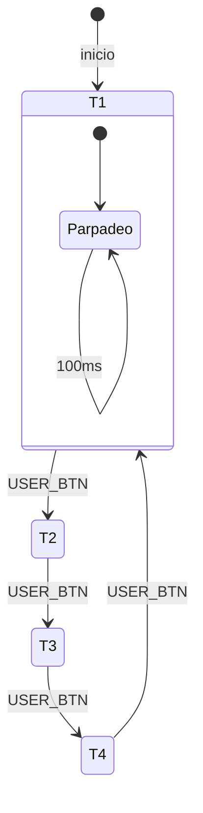

# App 1.4: Selector de Frecuencia de Parpadeo

## Título y Objetivos
**App 1.4: Sistema de Control de Frecuencia por Pulsador**

Implementar un sistema de parpadeo simultáneo de LEDs donde la frecuencia de alternancia es seleccionable mediante el pulsador de usuario. El sistema recorre cíclicamente cuatro frecuencias predefinidas (100ms, 250ms, 500ms, 1000ms).

## Especificaciones del Circuito
* **Hardware:** LEDs LD1, LD2, LD3 (Simultáneos).
* **Entrada:** Pulsador (USER_BTN).
* **Parámetros:** Array de constantes `tiempos[]`.

## Teoría de Operación
El programa utiliza una estructura de selección basada en un índice que accede a una tabla de constantes. Al detectar un flanco de subida en el pulsador, el índice se incrementa de forma modular, permitiendo alternar entre modos de frecuencia sin modificar la lógica principal.

## Arquitectura del Software
* **Capa 1:** Mapeo de hardware mediante estructuras.
* **Capa 2:** Driver de parpadeo simultáneo (`HAL_GPIO_TogglePin`).
* **Capa 3:** Lógica de control de flujo (Selector de frecuencia).

### Diagrama de Flujo

## Observaciones Técnicas en C
* **Almacenamiento en Flash:** Se recomienda declarar los arreglos como `static const` para asegurar que el compilador los asigne a la sección de memoria Flash (`.rodata`), ahorrando valiosos bytes de RAM.
* **Aritmética Modular:** El uso de `if (indice >= cant_intervalos) indice = 0;` es preferible en microcontroladores frente al operador módulo (`%`) cuando el divisor es una constante pequeña, ya que el compilador suele optimizarlo a una comparación directa, ahorrando ciclos de CPU.
* **Detección de flanco:** La variable `bool` actúa como un *de-bouncer* lógico básico. En implementaciones de alto rendimiento, se sugiere comparar con un contador de tiempo para evitar rebotes físicos del pulsador.

## Detalles de Robustez
* **Gestión de límites:** El uso de un contador de índice vinculado al `sizeof` del arreglo garantiza que, si se agregan más tiempos en el futuro, no es necesario actualizar la lógica de reinicio.
* **Seguridad:** Ante una escritura errónea en `indice`, la lógica de comparación `if` actúa como barrera de protección.

## Mapeo de Hardware
| LED | Puerto | Pin | Función |
| :--- | :--- | :--- | :--- |
| LD1 | GPIOB | LD1_Pin | Green LED |
| LD2 | GPIOB | LD2_Pin | Blue LED |
| LD3 | GPIOB | LD3_Pin | Red LED |

## Conclusión
La implementación demuestra la utilidad de las **tablas de búsqueda** (*look-up tables*). Al separar los parámetros temporales de la lógica de ejecución, el código es altamente mantenible: cambiar una frecuencia o añadir una nueva no requiere tocar la lógica principal del programa.