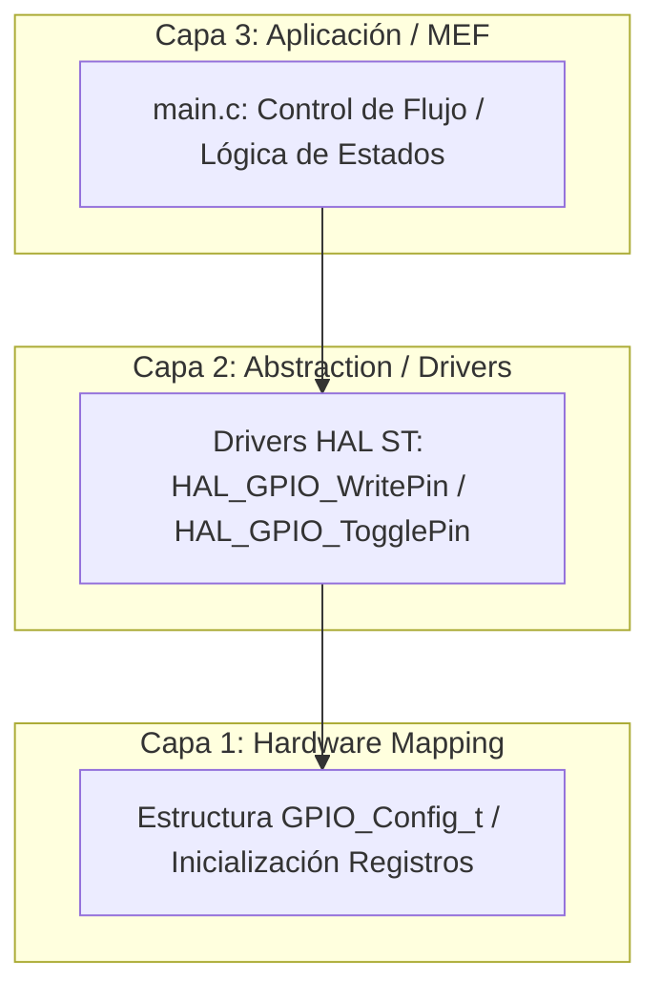

# Trabajo Práctico N°1

**Autor:** Mamani Flores Carlos
**Legajo:** 52797 
**Cátedra:** Técnicas Digitales 2  
**Año:** 2026 

---

## Título y Objetivos
**Desarrollo de Aplicaciones Embebidas Robustas y Arquitectura de Software en Capas**

El objetivo de este Trabajo Práctico es diseñar, implementar y documentar una serie de aplicaciones de control secuencial y temporal utilizando la placa de desarrollo **Nucleo-STM32F439ZI** y el entorno **STM32CubeIDE ** junto con la capa de abstracción **HAL (Hardware Abstraction Layer)** de ST.

Los objetivos específicos incluyen:
1. Implementar la captura determinista de eventos asíncronos externos (pulsadores) mediante detección de flancos no bloqueantes.
2. Diseñar Máquinas de Estados Finitos (MEF) estructuradas y jerárquicas para la gestión de modos de operación.
3. Adoptar un modelo de arquitectura de software en 3 capas que desacople la lógica de aplicación del silicio físico.

---

## Especificaciones del Circuito y Hardware
El desarrollo se unifica sobre el hardware nativo (*onboard*) de la placa de desarrollo, garantizando repetibilidad y robustez en los ensayos:

*   **Unidad de Procesamiento:** MCU STM32F439ZIT6 (Cortex-M4 a 180 MHz).
*   **Periféricos de Salida (Actuadores):** 
    *   `LD1` (LED Verde) conectado al puerto `GPIOB` (Pin definido por HAL).
    *   `LD2` (LED Azul) conectado al puerto `GPIOB`.
    *   `LD3` (LED Rojo) conectado al puerto `GPIOB`.
*   **Periférico de Entrada (Sensor):**
    *   `USER_BTN` (Pulsador Azul) conectado al puerto `GPIOC` configurado en modo Entrada sin Pull-up/Pull-down (acondicionamiento por hardware externo).

---

## Teoría de Operación General
El núcleo del TP se basa en la transición guiada de complejidad: desde secuencias cíclicas simples hasta sistemas multisecuenciales parametrizados por tablas de búsqueda (*look-up tables*). 

Todos los desarrollos comparten un motor de ejecución basado en el muestreo cíclico (*polling*) del estado del pulsador principal utilizando banderas de enclavamiento lógico (`bool`). Esto elimina los efectos de rebote iniciales y el procesamiento repetitivo del mismo evento de presión (*edge-triggering*).

---

## Arquitectura del Software

Para garantizar la portabilidad y facilitar la migración futura hacia otras plataformas (como la EDU-CIAA o arquitecturas AVR), el software se estructuró bajo un modelo estricto de **3 Capas**:

1. **Capa 1: Hardware Mapping (Direct Register / Configurations):** Representada por la estructura personalizada `GPIO_Config_t`. Almacena los punteros a las estructuras de registros de los puertos (`GPIO_TypeDef*`) y sus respectivas máscaras de bits (`uint16_t pin`), aislando la asignación física de pines.
2. **Capa 2: Abstraction / Drivers:** Capa intermedia provista por las funciones nativas de la HAL que interactúan de forma segura con los registros del microcontrolador sin alterar la lógica superior.
3. **Capa 3: Aplicación / FSM:** Reside en el lazo principal `while(1)`. Ejecuta las decisiones lógicas basándose únicamente en variables de estado e índices genéricos.

## Índice de Aplicaciones Desarrolladas
| Aplicación | Descripción Funcional | Enlace al Detalle |
| :--- | :--- | :--- |
| **App 1.1** | Secuenciador unidireccional cíclico de 3 LEDs (200ms). | [Ver README App 1.1](./App_1_1_Grupo_6_2026/README.md) |
| **App 1.2** | Secuenciador bidireccional controlado por sentido dinámico (`sentido *= -1`). | [Ver README App 1.2](./App_1_2_Grupo_6_2026/README.md) |
| **App 1.3** | Selector multisecuencial con MEF jerárquica (4 modos independientes). | [Ver README App 1.3](./App_1_3_Grupo_6_2026/README.md) |
| **App 1.4** | Parpadeo simultáneo con selector de frecuencia. | [Ver README App 1.4](./App_1_4_Grupo_6_2026/README.md) |

## Detalles de Robustez Global
* **Manejo de Estados Indeterminados:** Todas las estructuras `switch` implementan de forma obligatoria la cláusula `default` encargada de apagar el hardware e inicializar los punteros ante corrupciones de memoria.
* **Uso Eficiente de Memoria:** Los arreglos de configuración de pines y tablas de tiempos se califican como `const` o `static const`, forzando su almacenamiento en la sección `.rodata` de la memoria Flash, protegiendo la memoria RAM crítica del sistema.

## Conclusión
Este Trabajo Práctico establece los cimientos del diseño modular de firmware. El desacoplamiento logrado mediante la arquitectura de 3 capas y el uso de estructuras de datos genéricas demuestra que es posible agregar requerimientos funcionales complejos minimizando la reescritura de código y optimizando los ciclos de CPU del procesador Cortex-M4.